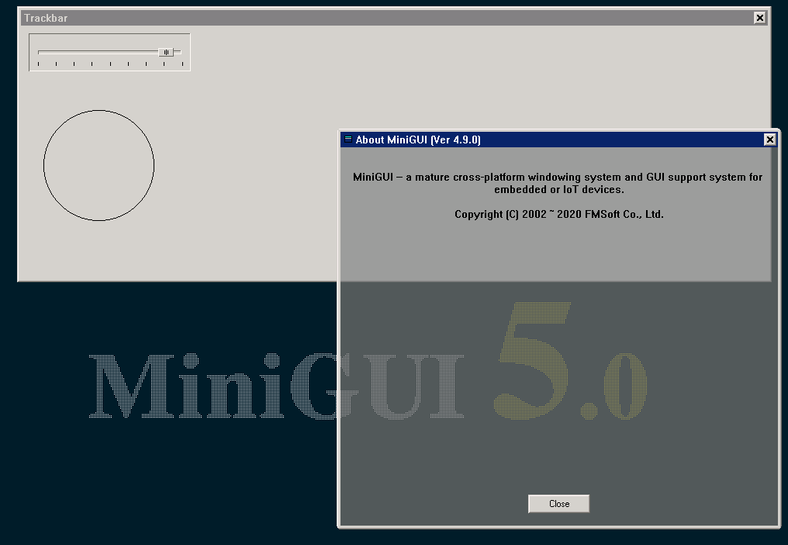
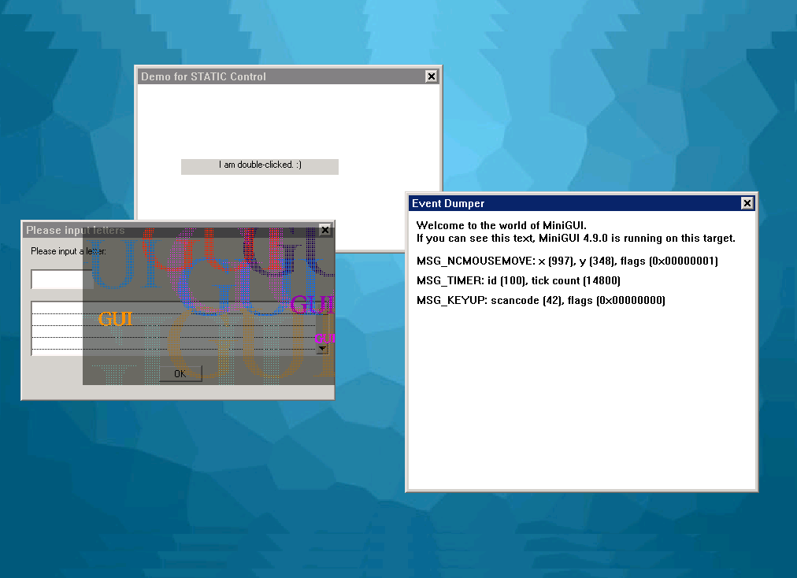

# Building MiniGUI 5.0

This repo contains some scripts to fetch and build MiniGUI 5.0.x

This instruction assumes that you are using Ubuntu Linux 18.04/20.04/22.04 LTS.

- [Current Status](#current-status)
   + [Changes in Version 5.0.x](#changes-in-version-50x)
   + [Known issues](#known-issues)
   + [Upcoming features](#upcoming-features)
- [Building MiniGUI](#building-minigui)
   + [Prerequisites](#prerequisites)
   + [Building steps](#building-steps)
   + [Options for build-minigui.sh script](#options-for-build_miniguish-script)
   + [Notes for demos](#notes-for-demos)
   + [Commands to build dependencies](#commands-to-build-dependencies)
- [Cross Building](#cross-building)
- [Change Log](#change-log)
- [Copying](#copying)
   + [Special Statement](#special-statement)
   + [Other Notes](#other-notes)

## Current Status

Currently, the latest official release of MiniGUI is version 5.0.10.

Main enhancements of MiniGUI Core and its components are as follow:

- Code tuned for GCC 9.3+, so that you can build MiniGUI on Ubuntu 20.04/22.04
  or other Linux distributions which use GCC 9 or later.
- MiniGUI Core:
   + Support for compositing schema under MiniGUI-Processes runtime mode.
     This feature brings the exciting visual effects which are popular
     on modern desktop computers or smart phones to MiniGUI.
   + New main window types/levels. You now can easily create main windows
     in different z-order levels. This enhancement allows us to create
     a special app which acts as screen lock, docker, or launcher.
   + Virtual Window. You now can easily create message threads under all
     runtime modes to exploit the messaging mechanism of MiniGUI in
     non GUI threads - we call them message threads.
   + Enhanced timer support. MiniGUI now manages the timers per message thread.
     Under MiniGUI-Threads runtime mode, you can set up 32 (64 on 64-bit
     architecture) timers for each GUI threads. If you enabled virtual window,
     you can also do this for each message thread.
   + Support for listening a file descriptor as long as the underlying system
     has the `select()` system call for all runtime modes. Now you can call
     `RegisterListenFD()` to register a file descriptor to be listened, and
     handle `MSG_FDEVENT` in your window callback procedure to read/write
     from/to the file descriptor. Before this version, this feature only
     available for MiniGUI-Processes runtime mode.
   + Support for local data of windows. You can now set or retrieve a local data
     which is bound with a string name for a window. This will give you an
     eays-to-use interface to manage various data of a window.
   + Support for hardware cursors under compositing schema. MiniGUI now can
     utilize the hardware cursors if your graphics device support it.
     You can also load a cursor from a PNG file.
   + Support for loading icon from a bitmap file. You can now load an icon
     from a bitmap file such as a PNG file.
   + Unified the message hook functions for all runtime modes. MiniGUI now
     provides the consistent message hook functions for all runtime modes.
   + Use the update regions for cumulative updating the screen. This will
     emilinate the flickers due to the frequently redrawning of controls.
   + Cleaned up a lot of internal symbols (the external functions and
     global variables) in order to avoid name polution.
   + Refactored the code for the following modules: z-order management,
     message queue, event/message handling, and part of graphics abstract
     layer.
   + Enhance the NEWGAL engine `fbcon` (the legacy Linux frame buffer) to
     support compositing schema.
   + Use upstream harfbuzz instead of the modified harfbuzz.
   + Support for WebP image files.
   + Some new APIs.
- mGEff, mGUtils, mGPlus, and mGNCS
   + Tune code for MiniGUI 5.0.0 or later.
   + Cleanup code for bad symbols.
- mGNCS4Touch
   + Tune code to comply with MiniGUI 5.0.0 and mGEff 1.5.0.
   + Tune the speed meter.
   + Enhance `ScrollViewPiece` and `HScrollViewPiece`.
- mg-tests:
   + ADD the `run-auto-tests.sh` script to run some tests automatically.
   + Add new test programs in `api/` directory.
   + Add a new test program for various image files in `images/` directory.
   + Add new test programs for new APIs of MiniGUI 5.0.x in `5.0/` directory.
   + Add new test programs for compositing schema in `compositor/` directory.
- gvfb:
   + Enhanced to use double buffering to support `SyncUpdate` method.
   + Enhanced to simulate the hardware cursors.

For more information, please refer to the release notes:

- MiniGUI Core: <https://github.com/VincentWei/minigui/blob/rel-5-0/RELEASE-NOTES.md>
- mGEff: <https://github.com/VincentWei/mgeff/blob/rel-5-0/RELEASE-NOTES.md>
- mGNCS4Touch: <https://github.com/VincentWei/mgncs4touch/blob/rel-5-0/RELEASE-NOTES.md>

### Changes in Version 5.0.x

1. Version 5.0.10 (2022-09-30)
   - MiniGUI Core:
      + Enhance `fbcon` engine to use double buffering and `SyncUpdate` method.
      + Cleanup and enhance `shadow` engine to use `SyncUpdate` method.
      + Fix some bugs for Threads mode and virtual window.
      + Fix some compilation warnings/errors against GCC 12.
   - mg-tests:
      + Add the `run-auto-tests.sh` script to run some tests automatically.
      + Add new test programs in `api/` directory.
1. Version 5.0.9 (2022-01-14)
   - MiniGUI Core:
      * Fix a crash bug in `InitSubDC()`.
   - mgncs4touch: remove `settingtableview` sample.
1. Version 5.0.8
   - MiniGUI Core:
      * Support for WebP image format based on libwebp.
      * Support for two ARM64-based hardware platforms: PX30 and R818.
      * New surface pixel format for main window: `ST_PIXEL_XRGB565` under compositing schema.
      * Some optimizations and tunnings.
   - minigui-test: new test program for loading various images.
1. Version 5.0.6
   - MiniGUI Core: Enhancement and optimize FillBox, BitBlt, and StretchBlt by using Pixman.
   - MiniGUI Core: Animations when switching layers for the compositing schema.
   - minigui-res: add fine-tuned Chinese font from iekie.
1. Version 5.0.5
   - MiniGUI Core: Adjust values of `WS_XXX` to avoid conflict.
1. Version 5.0.4
   - MiniGUI Core: Fixed a few minor bugs and add a new IAL engine for single touch screen.
1. Version 5.0.3
   - MiniGUI Core: Fixed a few minor bugs and made some enhancements.
   - mg-tests: Merge `comm-engines-freertos` from @ehello for FreeRTOS.
   - mg-demos: Merge `softkbd2` from @Iorest to use RIME input engine.

### Known issues

The following known issues all about hardware cursor of DRM engine:

- `drmSetCursor2` and `drmMoveCursor` do not work correctly in DRM engine.
  Libdrm does not provide an interface to set the correct cursor plane, and
  it seems that X held the cursor plane.
- When using a AR24 plane for cursor, `drmSetPlane` seems having a bad
  performance.

### Upcoming features

We plan to develop the following features in the subsequent releases:

- MiniGUI 5.0.x:
   + A comprehensive demonstration program for compositing schema and
     a sample compositor with animations.
   + Clean code of other frequently-used GAL/IAL engines.
- MiniGUI 5.2.x:
   + Support for the `WS_MAXIMIZE` and `WS_MINIMIZE` styles.
   + Tune the input method framework for MiniGUI-Processes runtime mode,
     so that the input method engine can run as a seperate process.

## Building MiniGUI

### Prerequisites

You should run `apt install <package_name>` to install the following packages
on your Ubuntu Linux.

* Building tools:
   * git
   * gcc/g++
   * binutils
   * autoconf/automake
   * libtool
   * make
   * cmake
   * pkg-config
* Dependent libraries:
   * libgtk2.0-dev
   * libjpeg-dev
   * libpng-dev
   * libwebp-dev
   * libfreetype6-dev
   * libinput-dev
   * libdrm-dev
   * libsqlite3-dev
   * libxml2-dev
   * libssl-dev

You can run the following commands to install all above software packages on Ubuntu 18.04/20.04/22.04:

```
$ sudo apt install git g++ binutils autoconf automake libtool make cmake pkg-config
$ sudo apt install libgtk2.0-dev
$ sudo apt install libjpeg-dev libpng-dev libwebp-dev libfreetype-dev libharfbuzz-dev
$ sudo apt install libinput-dev libdrm-dev libsqlite3-dev libxml2-dev libssl-dev
```

On Fedora use

```
$ sudo dnf install git gcc-c++ binutils autoconf automake libtool make cmake pkgconf
$ sudo dnf install gtk2-devel
$ sudo dnf install libjpeg-devel libpng-devel libwebp-devel freetype-devel harfbuzz-devel
$ sudo dnf install libinput-devel libdrm-devel sqlite-devel libxml2-devel openssl-devel
```

Note that the `gtk2` package is used by the virtual frame buffer program `gvfb`.

### Building steps

Please make sure that you can visit GitHub and you can do `sudo` on your Linux box.

1. Clone this repo from GitHub:

```
$ git clone https://github.com/VincentWei/build-minigui-5.0.git
$ cd build-minigui-5.0/
```

1. Copy `config.sh` to `myconfig.sh` and edit `myconfig.sh` to match your needs:

```
$ cp config.sh myconfig.sh
```

Note that we found the mirrors from our GitLab repositories to GitHub were often broken
due to the well known fire wall. So you can change your `myconfig.sh` file to
use our [GitLab site](https://gitlab.fmsoft.cn/) directly:

```
# Use this if you want to use our GitLab site via HTTPS
REPO_URL=https://gitlab.fmsoft.cn/VincentWei
```

1. Run `fetch-all.sh` to fetch all source from GitHub:

```
$ ./fetch-all.sh
```

1. Run `build-deps.sh` to build and install gvfb, chipmunk:

```
$ ./build-deps.sh
```

1. Run `build-minigui.sh` to build MiniGUI 5.0:

```
$ ./build-minigui.sh
```

1. Run `mguxdemo`:

```
$ cd cell-phone-ux-demo/
$ ./mginit
```

When there were some updates in the remote repos, you can run `update-all.sh` to
update them. You can run `clean-all.sh` to uninstall and clean them.

Note that you might need to run `ldconfig` to refresh the shared libraries cache
before running `mguxdemo` or other MiniGUI applications.

### Options for build-minigui.sh script

You can pass some options to `build-minigui.sh` script to specify the
compile-time configuration options of MiniGUI Core.

If you did not specify the options, it will use the following default options:

```
procs compositing virtualwindow
```

The options above have the following meanings:

- `procs`: build MiniGUI runs under MiniGUI-Processes runtime mode.
- `compositing`: build MiniGUI to use compositing schema.
- `virtualwindow`: enable virtual window.

The script uses a simple method for the traditional autoconf options:

- The first option always specifies the runtime mode of MiniGUI, you should
  choose one from `procs`, `ths`, or `sa`, which represent MiniGUI-Processes,
  MiniGUI-Threads, and MiniGUI-Standalone runtime modes respectively.
- If you specify an option with a prefix `-`, the feature will be disabled;
  otherwise it is enabled.

For example, if you want to build MiniGUI as standalone runtime mode and
without support for cursor, you can use the following command:

```
$ ./build-minigui.sh sa -cursor
```

### Notes for demos

For the sample of compositing schema, please refer to `mg-tests`:

```
$ cd mg-tests/compositing/
$ ./mginit trackbar
```



or

```
$ cd mg-tests/compositing/
$ ./mginit auto
```



You can also run other samples, demos, or test programs in `mg-samples`,
`mg-demos` or `mg-tests`.

Note that if you configured MiniGUI as a runtime mode other than
MiniGUI-Processes, please use the following commands to run `mguxdemo`

```
$ cd cell-phone-ux-demo/
$ ./mguxdemo
```

### Commands to build dependencies

The following steps are those ones in `build-deps.sh`. We list them here just
for your information:

1. Make and install `gvfb`:

```
$ cd gvfb
$ cmake .
$ make; sudo make install
$ cd ..
```

1. Make and install `chipmunk` library (DO NOT use the chipmunk-dev package
   which is provided by Ubuntu):

```
$ cd 3rd-party/chipmunk
$ cmake .
$ make; sudo make install
$ cd ../..
```

## Cross Building

MiniGUI 5.0.x can run on lots of CPUs with different architectures, such as
ARM, MIPS and so on, after cross compiled. There is a directory named
`cross-build/`, in which there are some scripts for cross building.

As an example, there is a directory name `arm-r16-linux`, which means: This
directory is for ARM-based SoC `r16`, and the operating system is Linux. In this
directory, there are two scripts for download packages, and build MiniGUI 5.0.x 
for ARM version. You can read the `README.md` in this directory in detail:

  - [arm-r16-linux](cross-build/arm-r16-linux/README.md)

Of course you can build your own directory for your CPU and OS.

## Change Log

Currently, this repo just includes some scripts to build MiniGUI 5.0.x
core, components, and demonstration apps.

## Copying

Copyright (C) 2018 ~ 2022 Beijing FMSoft Technologies Co., Ltd.

This program is free software: you can redistribute it and/or modify
it under the terms of the GNU General Public License as published by
the Free Software Foundation, either version 3 of the License, or
(at your option) any later version.

This program is distributed in the hope that it will be useful,
but WITHOUT ANY WARRANTY; without even the implied warranty of
MERCHANTABILITY or FITNESS FOR A PARTICULAR PURPOSE.  See the
GNU General Public License for more details.

You should have received a copy of the GNU General Public License
along with this program.  If not, see <http://www.gnu.org/licenses/>.

### Special Statement

The above open source or free software license does
not apply to any entity in the Exception List published by
Beijing FMSoft Technologies Co., Ltd.

If you are or the entity you represent is listed in the Exception List,
the above open source or free software license does not apply to you
or the entity you represent. Regardless of the purpose, you should not
use the software in any way whatsoever, including but not limited to
downloading, viewing, copying, distributing, compiling, and running.
If you have already downloaded it, you MUST destroy all of its copies.

The Exception List is published by FMSoft and may be updated
from time to time. For more information, please see
<https://www.fmsoft.cn/exception-list>.

### Other Notes

Also note that the software in `3rd-party/` may use different licenses.
Please refer to the `LICENSE` or `COPYING` files in the source trees for more
information.

Note that the software fetched from remote repositories may use different
licenses.  Please refer to the `LICENSE` or `COPYING` files in the source
trees for more information.

