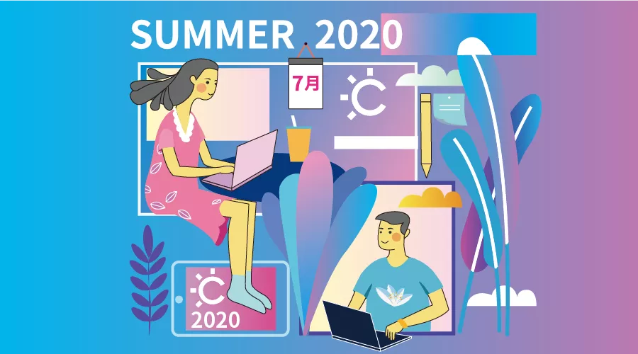

# 首届“暑期2020”项目说明

本文是 MiniGUI 社区参与中科院软件所发起的首届“暑期2020”活动的项目说明。

## 面向小屏幕智能设备的 MiniGUI 定制合成器

【项目标题】面向小屏幕智能设备的 MiniGUI 合成器

【项目描述】自 MiniGUI 5.0 起，MiniGUI 的多进程模式开始支持合成图式（compositing schema）。合成图式是现代桌面操作系统和智能手机操作系统的图形及窗口系统使用的技术，其基本原理很简单：系统中所有进程创建的每一个窗口都使用独立的缓冲区来各自渲染其内容，而系统中有一个扮演合成器（compositor）角色的进程，负责将这些内容根据窗口的 Z 序以及叠加效果（如半透明、模糊等）合成在一起并最终显示在屏幕上。本项目要求为 MiniGUI 5.0 的合成图式开发一个适合于小屏幕智能设备的定制合成器，实现自定义的窗口层叠效果（如阴影、模糊、不规则窗口等），以及窗口的切换动画等效果。

【项目难度】高

【项目社区导师】魏永明

【导师联系方式】vincent@minigui.org

【项目产出要求】
   - 可在 Ubuntu 18.04 上编译运行，使用 HybridOS 图形栈中的 Cairo 或者 Mesa (OpenGL ES）作为渲染引擎，实现一个定制的 MiniGUI 5.0 合成器，可参考效果：
     - 智能手机。
     - 中高档轿车中的车载娱乐系统。
   - 可整合 mgdemo、mguxdemo 等 MiniGUI 已有示例程序或者演示程序中的代码。注：这些代码均以 Apache 2.0 许可证发布。

【项目技术要求】
   - Linux 环境下的 C/C++ 编程
   - OpenGL ES 编程
   - MiniGUI、Cairo、Mesa 等软件

【相关的开源软件仓库列表】
   - <https://github.com/VincentWei/build-minigui-5.0>
   - <https://github.com/VincentWei/minigui>
   - <https://github.com/FMSoftCN/hicairo>
   - <https://github.com/FMSoftCN/himesa>
  
## MiniGUI 的 DRM 加速图形引擎

【项目标题】MiniGUI 的 DRM 加速图形引擎

【项目描述】DRM 已经成为 Linux 环境中新一代的现代图形支持框架。自 4.0 版本以来，MiniGUI 支持 DRM，但目前只提供了一个针对早期 Intel i915 芯片的加速图形引擎。该项目要求您为某个支持 DRM 且包含基础 2D 加速能力的 GPU 开发一个 MiniGUI 的 DRM 加速图形引擎。该 GPU 可以是 PC 显卡，也可以是嵌入式 SoC，如全志、瑞芯或者展讯的 SoC。

【项目难度】中

【项目社区导师】魏永明

【导师联系方式】vincent@minigui.org

【项目产出要求】
   - 符合 MiniGUI 5.0 DRM 引擎接口的加速引擎，可编译成动态库供 MiniGUI 在运行时动态装载。
   - 提供对显存管理、矩形填充、位块传输（Blitting）等的加速支持。

【项目技术要求】
   - Linux 环境下的 C/C++ 编程
   - MiniGUI、Mesa 等软件

【相关的开源软件仓库列表】
   - <https://github.com/VincentWei/build-minigui-5.0>
   - <https://github.com/VincentWei/minigui>
   - <https://github.com/FMSoftCN/himesa>
  
## HybridOS 图形栈增强

【项目标题】HybridOS 图形栈增强

【项目描述】HybridOS 是飞漫软件正在开发中的针对物联网的新一代操作系统。飞漫软件已基于 MiniGUI、Mesa、Cairo 等开源软件发布了 HybridOS 图形栈。在 Mesa 的 MiniGUI Backend 实现中，目前未提供对 EGL pixel buffer 的支持。本项目要求在现有 Mesa MiniGUI backend 的实现基础上，提供对 EGL pixel buffer 的支持。

【项目难度】中

【项目社区导师】魏永明

【导师联系方式】vincent@minigui.org

【项目产出要求】
   - 在现有 Mesa MiniGUI backend 的实现基础上，提供符合 EGL 规范 pixel buffer 相关接口实现。

【项目技术要求】
   - Linux 环境下的 C/C++ 编程
   - MiniGUI、Mesa 等软件

【相关的开源软件仓库列表】
   - <https://github.com/VincentWei/build-minigui-5.0>
   - <https://github.com/VincentWei/minigui>
   - <https://github.com/FMSoftCN/himesa>
  
## MiniGUI 中文输入法增强

【项目标题】MiniGUI 中文输入法增强

【项目描述】MiniGUI 现有开源的中文输入法引擎已经过时了。本项目要求移植一个成熟的开源中文输入法引擎，使得 MiniGUI 应用可以获得更好的中文输入法支持。

【项目难度】低

【项目社区导师】魏永明

【导师联系方式】vincent@minigui.org

【项目产出要求】
   - 选择一款较为流行的开源中文输入法引擎移植到 MiniGUI 环境中。
   - 可在 Ubuntu Linux 5.0 环境中运行。

【项目技术要求】
   - Linux 环境下的 C/C++ 编程
   - MiniGUI

【相关的开源软件仓库列表】
   - <https://github.com/VincentWei/build-minigui-5.0>
   - <https://github.com/VincentWei/minigui>
   - <https://github.com/VincentWei/mg-demos>
  
## 将 MiniGUI 5.0 运行到 RT-Thread 或者 FreeRTOS 开发板上

【项目标题】将 MiniGUI 5.0 运行到 RT-Thread 或者 FreeRTOS 开发板上

【项目描述】将 MiniGUI 5.0 (Standalone 或者 Threads 模式）移植到运行 RT-Thread 或者 FreeRTOS 的开发板上。需要开发针对具体开发板的图形引擎、输入引擎等。

【项目难度】低

【项目社区导师】魏永明

【导师联系方式】vincent@minigui.org

【项目产出要求】
   - 针对具体开发板的图形引擎及输入引擎。
   - 运行 MiniGUI、mGNCS、mGNCS4Touch 示例程序。
   - 如果内存配置允许，运行 mg-demos 中两个演示程序。

【项目技术要求】
   - RT-Thread 或 FreeRTOS 开发环境及 C/C++ 编程
   - MiniGUI

【相关的开源软件仓库列表】
   - <https://github.com/VincentWei/build-minigui-5.0>
   - <https://github.com/VincentWei/minigui>
   - <https://github.com/VincentWei/mgncs>
   - <https://github.com/VincentWei/mgncs4touch>
   - <https://github.com/VincentWei/mg-demos>
  
## 参考文档

   - [MiniGUI 5.0 发布说明](https://mp.weixin.qq.com/s?__biz=MzA5MTYwNTA3MA==&mid=2651104433&idx=1&sn=33f288b5129d7c4d35816664822b1cb4&chksm=8b89d590bcfe5c86b4551f843c6840194f67ea65388a87017bea01b9baaf5a1ee6c8e6d38f66&mpshare=1&scene=1&srcid=&sharer_sharetime=1590459093298&sharer_shareid=47aa6185bd050078ff321e79ad280097&exportkey=AYi6gDPJ%2BH5%2BwSHJ4VhUztI%3D&pass_ticket=fGB7Y%2BrNQRYaw0wXXaesS5W%2FMwNfZC7EYUJ31qr4M7MzqPbaYfkHpDmfp3974KS0#rd)
   - [MiniGUI Overview](https://gitlab.fmsoft.cn/VincentWei/minigui-docs/blob/master/MiniGUI-Overview.md)
   - [Writing DRM Engine Driver for Your GPU](https://gitlab.fmsoft.cn/VincentWei/minigui-docs/blob/master/supplementary-docs/Writing-DRM-Engine-Driver-for-Your-GPU.md)
   - [Using Compositing Schema](https://gitlab.fmsoft.cn/VincentWei/minigui-docs/blob/master/supplementary-docs/Using-Compositing-Schema.md)
   - [Integrating with GPU](https://gitlab.fmsoft.cn/VincentWei/minigui-docs/blob/master/programming-guide/MiniGUIProgGuidePart3Chapter05.md)

